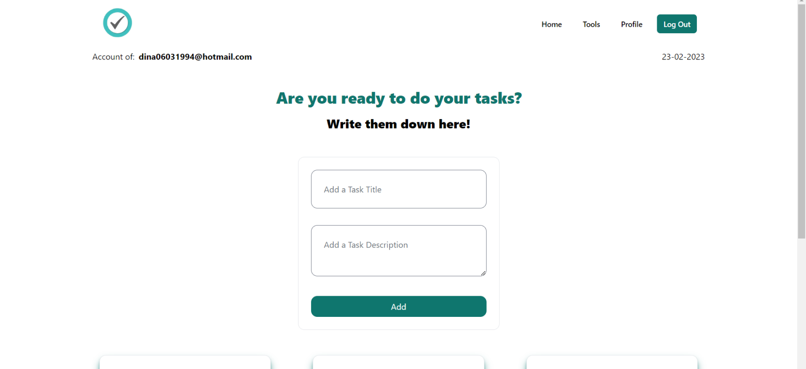

<!-- LOGOTIPO DEL PROYECTO -->
 

  
  <h2 align="center">Página web de tareas</h2>
  <a href="https://ironhack-final-tasks-5ead.vercel.app/auth/login">Visita el sitio web</a>

<!-- TABLA DE CONTENIDOS -->
<detalles>
  
Índice

  <ol>
    <li>
      <a href="#sobre-el-proyecto">Sobre Task ToDo</a>
      <ul>
        <li><a href="#construir-con">Tecnologías utilizadas</a></li>
      </ul>
    </li>
    <li>
    <a href="#hoja de ruta">Hoja de ruta</a>
     <ul>
     <li><a href="#backlog">Registro anterior</a></li>
        <li><a href="#day-one">martes 7 de febrero de 2023</a></li>
        <li><a href="#day-two">miércoles 8 de febrero de 2023</a></li>
        <li><a href="#day-three">jueves 09 de febrero de 2023</a></li>
        <li><a href="#day-four">Viernes 10 de febrero de 2023</a></li>
        <li><a href="#day-five">miércoles 15 de febrero de 2023</a></li>
        <li><a href="#day-six">Jueves 16 de febrero de 2023</a></li>
        <li><a href="#day-seven">lunes 20 de febrero de 2023</a></li>
        <li><a href="#day-eight">martes 21 de febrero de 2023</a></li>
        <li><a href="#day-nine">miércoles 22 de febrero de 2023</a></li>        
      </ul>
    </li>
    <li><a href="#acerca de">Sobre mí</a></li>
    <li><a href="#gracias-especiales">Agradecimientos</a></li>
    <li><a href="#technical-challenge">Desafío técnico</a></li>
    <li><a href="#gran-error">Gran Error</a></li>
  </ol>
</detalles>

<!-- SOBRE EL PROYECTO -->

##  Sobre Task ToDo

El proyecto Task ToDo es el proyecto final que he realizado en el bootcamp de desarrollo web FrontEnd de Ironhack. El proyecto demuestra lo aprendido en el curso, los conocimientos de Vue.js obtenidos y ademas poder conectarlo a una base de datos externa y gestionarla.

Es una aplicacion que permite a usuarios crear una cuenta, añadir tareas a completar y con ellas realizar un CRUD. Nuestra pagina web esta vinculada a una base de datos, donde estaremos almacenando todos los datos de usuarios y las tareas. En este caso, para gestionarlo utilizaremos Supabase, que nos ofrece un subconjunto de funcionalidades de Back End que nos permite gestionarlo como un servicio.

Primero he creado el proyecto y lo he ido dividiendo por componentes. Las vistas que tiene el proyecto son:
- Inicio: Contiene el componente Nav por el que se puede naver por toda la Web. También contiene El componente NewTask (donde se crea la nueva tarea) y también el componente TaskItem que es la tarea creada (desde este mismo componente se puede editar, marcar como tarea completada y elimitar tarea). Finalmente podemos encontrar un Footer que como el Nav estarán en el resto de vistas. 

- Account: Contiene como componente principal el Profile, donde podemos ver los datos del usuario, clicando al botón de Editar nos deriva gracias al Router a la vista  EditAccount. He añadido a esta vista un loader tipo Skeleton.

- EditAccount: Esta vista permite modificar los datos del usuario. 

- Tools: Esta vista contiene una calculadora, es un añadido que he creado a la Web por si el usuario necesita hacer un cálculo matemático. 

(<a href="#readme-top">volver arriba</a>)

###  Tecnologías utilizadas

- HTML
- Vue.js
- Tailwind (CSS)
- Supabase (backend)
- Vercel (deploy)
- Canva (presentación)

(<a href="#readme-top">volver arriba</a>)

##  Hoja de ruta

####  Día uno

######  martes 07, febrero 2023

* [x] Maquetar Sign Up y Sing In
* [x] Log Out.
* [x] Funcionalidad tarea completada. 
* [x] Crear repositorio y vincularlo a carpeta.

####  Día dos

######  miércoles 08, febrero 2023
*  [x] Implentar la lógica para el Sign Up, Sign In y Sing Out.
*  [x] Crear componentes del Navbar y el Footer.
*  [x] Empezar con el diseño del componente addTask.

####  Día tres

######  jueves 09, febrero 2023

* [x] Aprende a usar Tailwind y aplicarlo al proyecto.
* [x] Maquetación de Header.
* [x] Maquetación de Home.

####  Día cuatro

######  viernes 10 de febrero de 2023
* [x] Maquetación Login y Sing Up.
* [x] Lógica de Profile.
* [x] Maquetación Profile.
####  Día cinco

######  miércoles 20 de febrero de 2023

* [x] Hamburguer del Header.
* [x] Home responsive.
* [x] Imagen del Profile.
* [x] Datos vacíos de Profile.

####  Día seis

######  jueves 21 de febrero de 2023

* [x] Si le das al botón completado, se deshabilitan el resto. 
* [x] Arreglar error de bg en Login y SignUp.

####  Día siete

######  lunes 22 de febrero de 2023

* [x] Maquetar responsive Profile y Edit Profile.
* [x] Modal de Delete.
* [x] Día actual en Home + correo.

####  Día ocho

######  martes 23 de febrero de 2023

- [x] Loader.
- [x] Readme.
- [x] Presentación.

####  Día nueve

######  miércoles 24 de febrero de 2023

- [x] Presentación proyecto final.

(<a href="#readme-top">volver arriba</a>)

<!-- Acerca de mi -->

##  Sobre mí

Dina Yamani - dina.yamanid@gmail.com

LonkedIn: [https://linkedin.com/in/dina-yamani] (linkedin.com/in/dina-yamani)

Enlace del proyecto: [ github.com/Dweina1920](https://github.com/Dweina1920/ironhack-final-tasks)

####  Experiencia académica

- Desarrollo Web FullSatck - Factoría F5

- Desarrollo Web Fronted - Ironhack Barcelona

(<a href="#readme-top">volver arriba</a>)

<!-- AGRADECIMIENTOS -->

##  Agradecimientos

- Agradecer a todos mis compañeros de bootcamp por el apoyo y por compartir información entre nosotros para mejorar nuestros proyectos.
- A nuestros profesores por ayudarnos con nuestras dudas y darnos apoyo.

(<a href="#readme-top">volver arriba</a>)

##  Desafío técnico

- Un desafío importante ha sido el hecho de aprender Vue.js en una semana y poder realizar un proyecto completo. 

- También ha sido un desafío aprender Tailwind, y aprender a realizar una página web apta para ordenador, tablet y móvil completamente hecho con Tailwind. 

- Realizar una calculadora también ha sido todo un reto.

- El loader ya que es la primera vez que lo hacía. 

(<a href="#readme-top">volver arriba</a>)

##  Gran error

Mi gran error ha sido no arriesgar mucho con el estilo, y por ello ha quedado algo bastante simiple. 

(<a href="#readme-top">volver arriba</a>)

# ToDo App

[Click para acceder a la web](https://todo-zantonz.vercel.app/)

Autor: Anton Zyrianov
Fecha: 25/08/2022

## Descripcion

Se trata del proyecto final realizado durante el bootcamp de Front End Development en el Ironhack que consiste en una pagina web que te permite gestionar tus tareas.

Es una aplicacion creada con Vue.js que permite a usuarios crear una cuenta, añadir tareas a completar, editarlas, marcarlas como completadas y finalmente borrarlas. Nuestra pagina web esta vinculada a una base de datos, donde estaremos almacenando todos los datos de usuarios y las tareas. En este caso, para gestionarlo utilizaremos Supabase, que nos ofrece un subconjunto de funcionalidades de Back End que nos permite gestionarlo como un servicio.

__El objetivo__ de este proyecto es poner en practica los conocimientos de Vue.js obtenidos durante el curos y ademas poder conectarlo a una base de datos externa y gestionarla.

